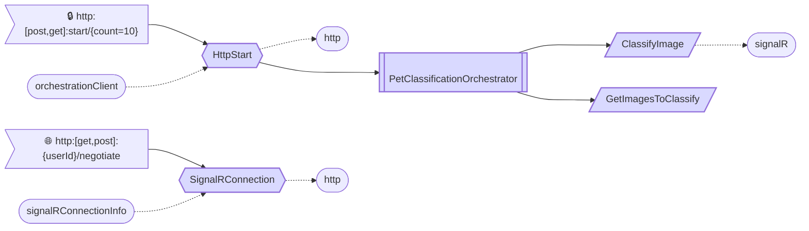

Mermaid FlowChart:

```mermaid

graph LR
HttpStart{{"#32;HttpStart"}}:::function
style HttpStart fill:#D9D9FF,stroke-width:2px
HttpStart.httpTrigger>"#128274; http:[post,get]:start/{count=10}"]:::httpTrigger --> HttpStart
HttpStart.0.orchestrationClient(["#32;orchestrationClient"]):::orchestrationClient -.-> HttpStart
HttpStart -.-> HttpStart.0.http(["#32;http"]):::http
SignalRConnection{{"#32;SignalRConnection"}}:::function
style SignalRConnection fill:#D9D9FF,stroke-width:2px
SignalRConnection.httpTrigger>"#127760; http:[get,post]:{userId}/negotiate"]:::httpTrigger --> SignalRConnection
SignalRConnection.0.signalRConnectionInfo(["#32;signalRConnectionInfo"]):::signalRConnectionInfo -.-> SignalRConnection
SignalRConnection -.-> SignalRConnection.0.http(["#32;http"]):::http
ClassifyImage[/"#32;ClassifyImage"/]:::activity
style ClassifyImage fill:#D9D9FF,stroke-width:2px
PetClassificationOrchestrator ---> ClassifyImage
ClassifyImage -.-> ClassifyImage.0.signalR(["#32;signalR"]):::signalR
GetImagesToClassify[/"#32;GetImagesToClassify"/]:::activity
style GetImagesToClassify fill:#D9D9FF,stroke-width:2px
PetClassificationOrchestrator ---> GetImagesToClassify
PetClassificationOrchestrator[["#32;PetClassificationOrchestrator"]]:::orchestrator
style PetClassificationOrchestrator fill:#D9D9FF,stroke-width:2px
HttpStart ---> PetClassificationOrchestrator

```

Or, as an image:

